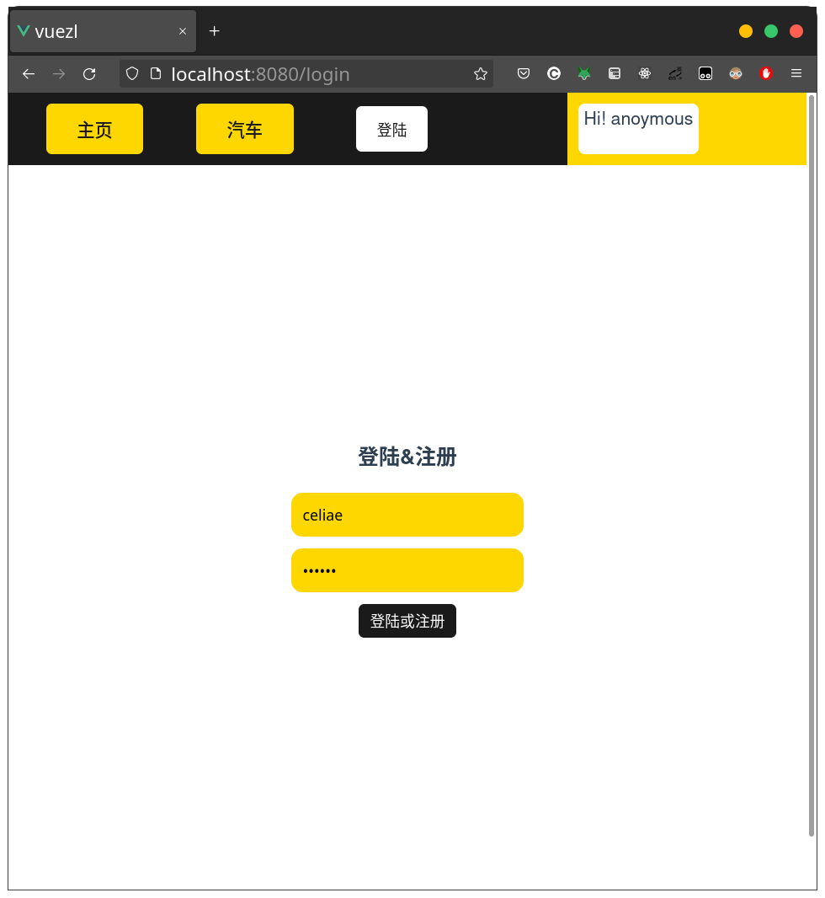

# 开发目的
为私人车商为私人车商提供一个友好的车辆管理服务.

 
 

## 分支布局
- master
  - 截图
  - 数据库
  - 介绍
- frontend
  - 前端源代码
- backend
  - 后端源代码

## *截图*
1. ### 主页

 

2. ### 汽车管理

 

3. ### 用户管理

 

4. ### 退出界面

 

5. ### 登陆界面

 

***
## 开发环境
 

- **OS** - *操作系统*
  - Archlinux - *社区驱动操作系统*
  - Gnome 42 - *Linux桌面*
  - ---
- **IDE** - *集成开发环境*
  - Code-OSS - *vscode开源版本*
  - ---
- **Frontend** - *前端*
  - Vue.js - *框架*
  - sweetlert - *警告提示插件*
  - Axios - *前后端交互插件*
  - Yarn - *包管理器*
  - ---
- **Backend** - *后端*
  - Springboot - *框架*
  - JPA - *数据库交互插件*
  - lombok - *Getter&Setter*
  - ---
- **Database** - *数据库*
  - Mariadb - *系统*
  - Dbeaver - *开源管理软件*
  - ---
- **Github Copilot** - *AI编码助手*
  

### **etc**......